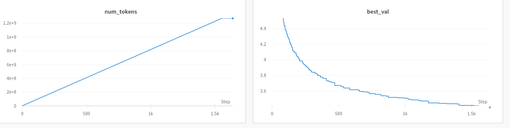

# GPT

Prototyping some gpt training code to understand how language models work.

Loosely reproduced the GPT-2 loss curves on [openwebtext](https://huggingface.co/datasets/openwebtext). Validation log loss gets to around 3.4 after training for about 1 billion tokens on 1 Titan RTX GPU for 5 days.

Loss Curve:

# Sources
- [NanoGPT](https://github.com/karpathy/nanoGPT/tree/master/data) 
- [GPT-2](https://d4mucfpksywv.cloudfront.net/better-language-models/language_models_are_unsupervised_multitask_learners.pdf)
- [GPT-3](https://arxiv.org/abs/2005.14165)
